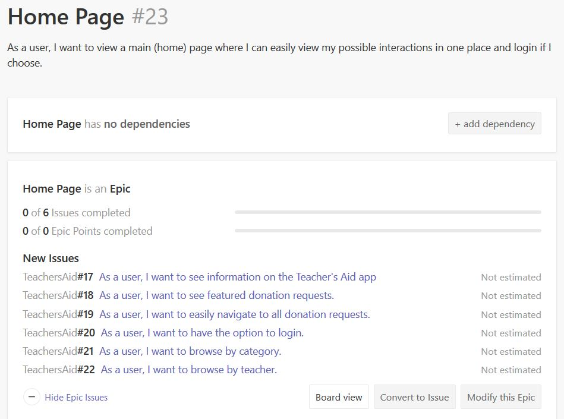
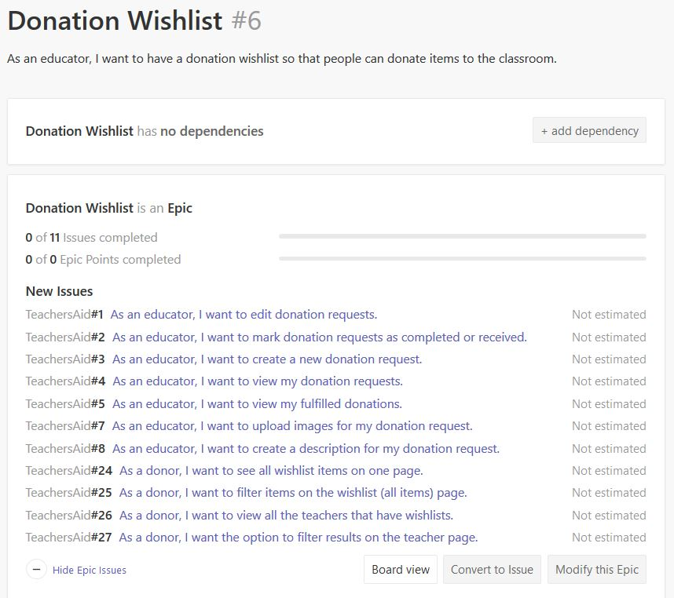
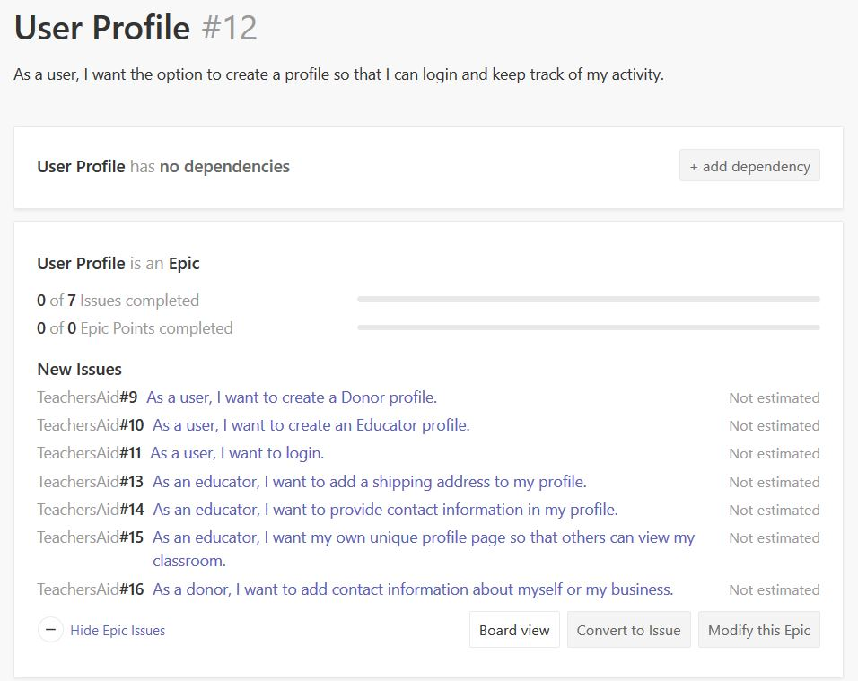

# Workflow showing Epics and User Stories created in GitHub Issues using ZenHub.

### Home Page Epic and User Stories

### Wireframes
#### This is the complete wireframe for the Home Page User Stories
Features:
1. Navigation provides a CTA (show all wishlists)
1. Navigation provides User Signup and User Login
1. Slider will provide background info on the Teacher's Aid app
1. Immediately following the slider is a section with a search bar and CTA buttons (search by category, search by teacher)
1. Featured Wishlists

### Donation Wishlist Epic and User Stories

### Wireframes
#### All Wishlist Items Page
Features:
1. All Wishlist items on one page
2. Aside section for Search bar and Filters (Category, Teacher)

#### All Teachers Page
Features:
1. All Teacher's on one page
2. Aside section for Search bar and Filters (Subject, Grade)

### User Profile Epic and User Stories

### Wireframes
